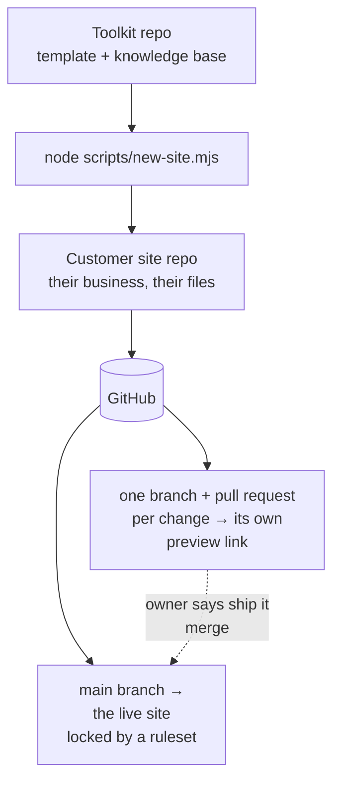

# Main Street (working name)

**A professional website for your small business for about $12 a year.** No page builder. No monthly fees. No developer on retainer. You update it by talking: tell your AI assistant what you want in plain English, look at the preview on your phone, and say "ship it."

**Watch how it works** (36 seconds, no sound needed):

https://github.com/user-attachments/assets/752e5e89-482f-40f9-b1c0-d4fab41c60b9

**Watch the full build** (70 seconds, no sound needed): one barbershop, idea to live site.

https://github.com/user-attachments/assets/a0c8180d-cec6-4d3b-bd72-366a873c2776

(The second video shows a helper doing the one-time setup from a terminal. You don't need one: your AI can do setup with you now, see below. Day to day looks like the first video: one message, one preview link, "ship it.")

## Is this for you?

- You own a small business and want a website that looks professional.
- You don't want to learn a page builder or pay a monthly fee.
- You're comfortable chatting with an AI assistant, and you have (or will get) a paid plan, about $20 a month: Claude Pro or ChatGPT Plus.

If that's you, keep reading. You need about an hour, and later a domain name (about $12 a year).

## How it works (the 30-second version)

1. **You say what you want**, in plain words: "Change our Saturday hours to 9 to 2." You say it to the AI chat you already pay for. No API keys, no usage billing.
2. **You get a preview link.** Open it on your phone. It looks exactly like your site with the change applied.
3. **You say "ship it."** Your live site updates in about a minute.

That's the whole system. Nothing goes live until you say "ship it," and every change gets its own preview link first. Made a mistake? Say "undo that" and your AI prepares the undo the same way.

## It doesn't end at launch

Most of this system is about what happens *after* the site goes live, because that's when websites usually start rotting:

- **Monthly checkup.** Say "run the monthly checkup" and your AI walks the site looking for stale hours, old photos, and broken links, then proposes fixes in plain English. The site taps you on the shoulder; you don't have to remember.
- **Voice-note updates.** Talk instead of typing whenever you like. Your AI says back what it heard and takes it from there.
- **"Undo that."** Every change is reversible in plain words.
- **No lock-in.** It works with the AI plan you already pay for (Claude, ChatGPT, or another AI that can work on GitHub). Your site is plain files in your own GitHub repo, and the operating manual (`AGENTS.md`) lives inside it, so any AI that can read the manual can run your site. Switch AIs tomorrow and nothing breaks.

## What it costs, honestly

About $12 a year for the domain name. Hosting and everything else run on free tiers. The one other cost is a paid AI plan (about $20 a month, Claude Pro or ChatGPT Plus), which many owners already have; no API usage charges, ever. The full breakdown, including free-tier limits and what could optionally cost money: [docs/the-12-dollar-stack.md](docs/the-12-dollar-stack.md).

## You don't need to be technical, or a helper

- **Setup: about an hour, done by you and your AI.** Make two free accounts (GitHub and Cloudflare) and an empty repository, then tap one link. Your AI copies the website in, interviews you about your business, writes your homepage, and walks you through the remaining clicks. It keeps a checklist, so you can stop and pick up later. Start here: [setup guide](template/docs/setup-guide.md). A technical helper is welcome but optional.
- **Day to day: no code, no terminal, no jargon.** Tap your **Edit my website** button and say what you want. Your AI handles the technical parts; you make the decisions.
- **On a free AI plan?** There is a slower path where your AI writes the change and you paste it in on GitHub: [browser-only setup](template/docs/browser-only.md).

See what a finished site looks like and how easy everyday updates are: [template/docs/examples.md](template/docs/examples.md).

---

## Setting up sites for others (agencies, freelancers, helpers)

> Business owners can stop here: [the setup guide](template/docs/setup-guide.md) is all you need, and your site's own README is written for you.

Two repositories, two audiences:

- **This repo (the toolkit)**: the generator. The pristine site template, the scaffolder, the AI knowledge base (rules, features, presets), and the guides.
- **Each customer site repo**: a scaffolded copy of `template/`, owned by the business. This is where the owner lives with their AI assistant. They never need to see this toolkit.



### Scaffold a new site

```bash
node scripts/new-site.mjs ../acme-plumbing
cd ../acme-plumbing
npm install
npm run setup
```

`new-site.mjs` copies `template/` into the target folder, names the package after the directory, verifies the copy, and initializes git. It refuses to overwrite a non-empty directory without `--force`, refuses to build inside the toolkit folder (your site lives **next to** the toolkit as `../acme-plumbing`, so it can become its own GitHub repo), and it never touches the network.

Then follow the setup guide inside the new site (`docs/setup-guide.md`, "For helpers who prefer a terminal"), in the **owner's** accounts. An owner with Claude Pro can skip the scaffolder entirely: their AI follows [AI-SETUP.md](AI-SETUP.md) to copy the template into an empty repository and run setup with them.

> **Heads-up from real experience:** when you connect the repo in Cloudflare Pages, the Cloudflare Pages GitHub App may only have access to some of your repos, and the repo picker will say "No repositories matching." Fix: on GitHub, go to Settings → Applications → Cloudflare Pages → Configure, and grant it access to the new repo (or all repositories). Then the repo appears in the picker.

### The model every site follows

- **One change, one pull request, one preview link.** Cloudflare Pages builds every branch and posts its preview link on the pull request. The owner opens it on their phone.
- **Owner says "ship it" → the pull request merges → production.** `main` deploys to the live site automatically, and a GitHub ruleset (public repos, free) means nothing reaches `main` any other way. "Undo that" is a revert, shipped the same way.
- **Deploys only from git.** No manual deploys, ever. They bypass the record and the next merge silently reverts them.
- **Missing key? The feature degrades, the page never breaks.** The one key (contact form) lives in Cloudflare under Production, never in a repo and never in Preview.

### What's in this repo

```
template/            The pristine generated site. Scaffold it, don't edit it in place.
  index.html         Homepage (neutral placeholder copy; the wizard + AI fill it in)
  site.config.json   Business facts + feature flags (neutral defaults, schema-validated)
  scripts/           setup wizard, presets, post-deploy audit, image optimizer
  AGENTS.md          The operating manual every AI reads (CLAUDE.md points to it)
  SETUP.md           The setup checklist the owner's AI works through
  rules/             Focused instruction files the AI loads on demand
  features/          One doc per toggleable feature
  presets/           Business-type bundles (bakery, restaurant, home-services, ...)
  docs/              Owner-facing guides: setup, connect your AI, examples, FAQ
  functions/         Cloudflare Pages Function for the contact form
AI-SETUP.md          Bootstrap instructions for an owner's AI setting up a new site
scripts/
  new-site.mjs       The scaffolder: template/ → new customer repo
  make-journey-video.py  Regenerates the 36-second walkthrough video (PIL + ffmpeg)
  make-end-to-end-video.py  Regenerates the 70-second idea-to-live-site video (PIL + ffmpeg)
docs/
  the-12-dollar-stack.md   The honest bill: what's free, what the domain costs
  for-agencies.md          The per-client playbook
  pressure-test.md         The adversarial review (see below)
```

The knowledge base (`rules/`, `features/`, `presets/`) lives **only** in `template/`: every customer site carries its own copy, so each site is self-sufficient and its AI never needs this toolkit.

### Improving the template

1. Make the change in `template/` here.
2. Validate it: scaffold a throwaway site with `new-site.mjs`, run `npm install`, `npm run setup`, `npm run build`, and the audit.
3. Commit here. Existing customer sites pick up template improvements through their AI assistant (or a manual copy). There is deliberately no auto-update: the owner's live site never changes without them saying so. Sites made before October 2026: [docs/upgrading.md](docs/upgrading.md).

### Pressure test

[docs/pressure-test.md](docs/pressure-test.md) is the adversarial review: zero-skill walkthrough findings, hostile-input tests, broken-state recovery, the top-5 ways an owner gets stuck, cost honesty, the abandoned-for-a-year test, and a security once-over, with what was fixed and what wasn't.
