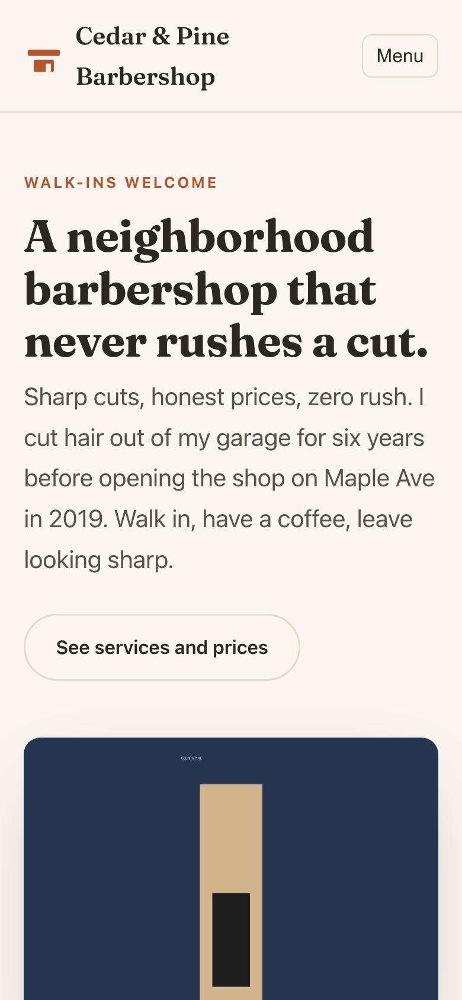

# Main Street

**A professional website for your small business, for about $12 a year.**

You change it by talking to the AI you already use, **Claude** or **ChatGPT**. Say "change our Saturday hours to 9 to 2." Your AI sends you a preview link. You look at it on your phone and say **"ship it."** A minute later, your website is updated.

No page builder. No monthly website fee. No developer to wait on.

**Watch it work** (36 seconds, no sound needed): tap Edit my website, say what you want, look at the preview, say "ship it."

https://github.com/user-attachments/assets/a089af2c-e9e5-4ef4-9e1f-6efad7cdfd39

**Watch a whole setup** (70 seconds): one bakery, from no website to live, done by the owner with their AI.

https://github.com/user-attachments/assets/d84e840e-50ad-4bf6-ab4c-a339280051ed

### [Set up my website →](template/docs/setup-guide.md)

About two hours, much of it waiting, and you can do it yourself. Your AI walks you through every step, and you can stop and pick up later.

## Is this for you?

- You run a small business: a shop, a salon, a trade, a bakery, a studio.
- You want a website that looks professional, and you want to keep it up to date yourself.
- You have, or are happy to get, a paid AI plan, about $20 a month: **Claude Pro** or **ChatGPT Plus**. Either works, and the setup guide has steps for each.

## How it works

1. **Say what you want**, in plain words. Type it or say it out loud.
2. **Open the preview link** your AI sends. It's your website with the change, on your phone.
3. **Say "ship it."** Your live website updates in about a minute. (On ChatGPT, it's two taps: **Create PR**, then **Squash and merge**.)

Nothing goes live until you say "ship it." Changed your mind? Say **"undo that"** and your AI takes it back: right away if it was the latest change, or with a quick preview if newer changes went live after it.

## What it costs

| What | Cost |
|---|---|
| Your domain name (yourbusiness.com) | about $12 a year |
| Hosting, security, visitor stats, email forwarding, contact form | $0 (free plans) |
| Your AI plan | about $20 a month, which many owners already pay |

Nothing on your website bills by usage, so it can't run up a surprise charge. The full, honest bill: [the $12 stack](docs/the-12-dollar-stack.md).

## It keeps working after launch

- **Monthly checkup.** Say "run the monthly checkup." Your AI looks for old hours, tired photos, and broken links, then suggests fixes. Nothing changes without your yes.
- **Voice notes.** Talk instead of typing. Your AI says back what it heard before it changes anything.
- **It's yours.** Your website lives in your own free accounts, and the instructions your AI follows live inside it. Switch AIs, or stop using this toolkit, and your site keeps running.

## Next steps

- **Set up:** [the setup guide](template/docs/setup-guide.md). About two hours, no helper needed.
- **See everyday updates:** [examples](template/docs/examples.md).
- **Questions:** [FAQ](template/docs/faq.md).
- **On a free AI plan?** There's a slower path where you do the clicks: [browser-only guide](template/docs/browser-only.md).

---

## For helpers, agencies, and contributors

- **Setting up a site for someone, from a terminal:** [START-HERE.md](START-HERE.md).
- **Doing it for clients:** [docs/for-agencies.md](docs/for-agencies.md).
- **Improving the toolkit:** [CONTRIBUTING.md](CONTRIBUTING.md).
- **The adversarial review of the whole system:** [docs/pressure-test.md](docs/pressure-test.md).

MIT licensed. "Main Street" is a working name.
