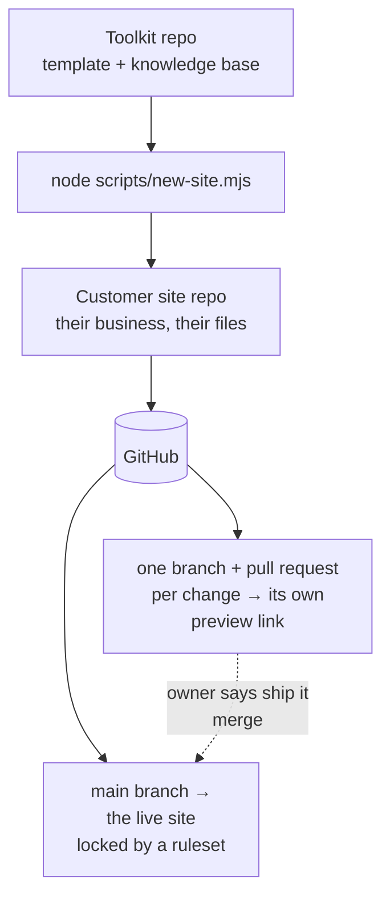

# START HERE (for helpers)

**Setting up your own business's website?** You don't need this page or a terminal. Follow the [setup guide](template/docs/setup-guide.md): two free accounts, one **Deploy to Cloudflare** button, and your AI does the rest with you (about two hours, much of it waiting).

This page is for **helpers who prefer a terminal** (the Deploy button is still the easiest start, even for you): an agency, a freelancer, or a tech-savvy friend setting a site up in the owner's accounts. Doing this for paying clients? Also read [docs/for-agencies.md](docs/for-agencies.md).

**Watch the owner-alone setup** (70 seconds, no sound needed): one bakery, from no website to live, with the owner's own AI doing the technical parts. This page covers the terminal alternative for helpers.

https://github.com/user-attachments/assets/65639c52-fde4-4f93-94ea-3bd3e551e4b2

## How it fits together

This toolkit is the **generator**. It holds a pristine site template, a scaffolder script, and the AI knowledge base (rules, features, presets). You use it to create one **customer site**: a separate repository that belongs to the business. The owner lives in their site with their AI; they never see this toolkit.



The model every site follows:

- **One change, one pull request, one preview link.** Cloudflare (Workers Builds) builds every branch and posts its preview link on the pull request.
- **"Ship it" merges; "undo that" reverts.** `main` deploys to the live site automatically, and a GitHub ruleset (free on public repos) means nothing reaches `main` any other way. An undo is published right away for the most recent ship, and previewed first when newer changes went live after it.
- **Deploys only from git.** No manual deploys, ever: they bypass the record, and the next merge silently reverts them.
- **Not set up yet? The feature steps back; the page never breaks.** There are no API keys. The contact form's one setting (`CONTACT_TO_EMAIL`, the owner's inbox) is a Cloudflare secret, never in the repo and never on previews.

## 1. Create the site (2 minutes)

From this toolkit folder:

```bash
node scripts/new-site.mjs ../acme-plumbing
```

The `../` matters: the site lives **next to** the toolkit, not inside it, so it can become its own repository. The script copies the template, names the package and the Cloudflare site (`name` in `wrangler.jsonc`, which becomes the free address, so keep the folder name short), verifies the copy, and initializes git. It refuses to overwrite a non-empty folder without `--force`, refuses to build inside the toolkit folder, and never touches the network.

## 2. Make it theirs (10 minutes)

```bash
cd ../acme-plumbing
npm install
npm run setup
```

The wizard asks plain questions (business name, phone, email, address, domain, kind of business) and applies a preset. No domain yet? Press Enter: the site starts on a free address.

Check it with `npm run dev` (usually http://localhost:5173), or `npm run serve` to run it exactly the way Cloudflare will, with no login. Then tick boxes 1 and 2 in the site's `SETUP.md`.

## 3. Put it on GitHub, in the owner's account (5 minutes)

Create the repository at github.com/new, signed in as the owner: same name as the folder, **Public**, no README. Then:

```bash
git add -A
git branch -M main
git commit -m "First version of the site"
git remote add origin https://github.com/OWNER/REPO.git
git push -u origin main
```

(`git add -A` matters: the scaffolder staged the template before the wizard ran, so without it the first commit ships the placeholder business.)

## 4. Finish setup with the owner (30 minutes)

Follow the site's `docs/setup-guide.md` in the owner's accounts, with the owner beside you: **Step 3** (connect the owner's AI to GitHub), then **Step 5** onward:

- **Connect Cloudflare** (`SETUP.md` box 3): **Workers & Pages** → **Create application** → **Import a repository** → the repo. The project name must be exactly the `name` in `wrangler.jsonc`; keep the suggested build (`npm run build`) and deploy (`npx wrangler deploy`) commands. Then **Settings** → **Variables and Secrets** → add the secret `CONTACT_TO_EMAIL` (the owner's inbox).
- **Step 5:** check it's live and the repo is public.
- **Step 6:** lock the live site (GitHub ruleset and settings).
- **Step 7:** make the owner's **Edit my website** button, and have the owner ship one change and one undo themselves.
- **Your site card:** make sure the owner turns on GitHub two-step sign-in and writes down their logins and recovery codes.

The domain, business email (which also turns on the contact form), and visitor stats are in the same guide under "Later," whenever the owner is ready. Never `wrangler deploy` from your machine: Cloudflare builds from git.

> **Cloudflare can't see the repo?** If the repo picker says "No repositories matching," the Cloudflare GitHub App only has access to some repos. On GitHub: your picture → **Settings** → **Applications** → **Installed GitHub Apps** → **Cloudflare Workers and Pages** → **Configure** → add the repo → **Save**. Then refresh Cloudflare.

## 5. Check it

Run the audit against the free address (and again once the domain is live):

```
$ npm run audit https://acme-plumbing.<account>.workers.dev

  PASS  homepage returns 200
  PASS  /privacy-policy/ returns 200
  PASS  /terms-of-service/ returns 200
  PASS  missing page returns 404
  PASS  http redirects to https
  PASS  free address sends X-Robots-Tag noindex
  PASS  homepage has JSON-LD structured data
  PASS  homepage has og:title

8/8 checks passed.
```

## If something looks wrong

1. Don't panic. Nothing here can send anyone a bill, and almost nothing is irreversible.
2. Ask the AI: "what just changed, and how do we undo it?" Then say "undo that."
3. Live site broken right now? Emergency brake: Cloudflare dashboard → **Workers & Pages** → the site → **Deployments** → the last good one → **Rollback**. Then have the AI revert the bad change too, or the next "ship it" publishes it again.

## More

- What's in this repo, and how to improve the template: [CONTRIBUTING.md](CONTRIBUTING.md).
- The honest bill: [docs/the-12-dollar-stack.md](docs/the-12-dollar-stack.md).
- Sites made before October 2026: [docs/upgrading.md](docs/upgrading.md).
- The adversarial review of the whole system: [docs/pressure-test.md](docs/pressure-test.md).
