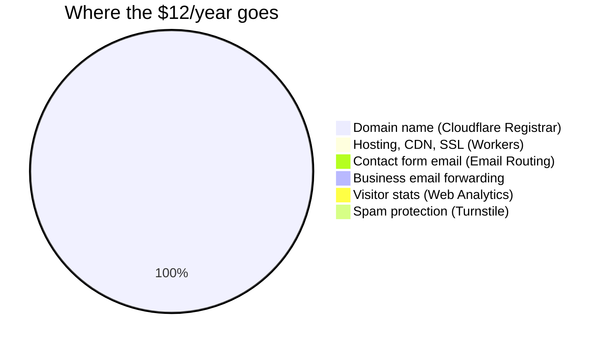

# The $12/year stack: the honest bill

Every service this template uses, what it costs, and where the free tier ends. No surprises is the point.

## The bill

| Service | What it does | Cost | Free-tier limit (the part that matters) |
|---|---|---|---|
| **Cloudflare Registrar** | Your domain name | ~$10/year | It's a domain. Renew yearly. |
| **Cloudflare Workers** (static assets + Workers Builds) | Hosting, CDN, SSL, deploys, preview links | $0 | Page and photo requests are free and unlimited. The contact form's code gets 100,000 runs a day; builds get 3,000 minutes a month. A small business site will never touch these ceilings. |
| **Cloudflare Email Routing** | `you@yourdomain.com` → your Gmail, and the contact form's emails to you | $0 | Forwarding is unlimited. Contact form emails to your own verified inbox are free on every plan and don't count toward any quota. (It's forwarding, not a mailbox.) |
| **Cloudflare Web Analytics** | Visitor stats, no cookies, no key (a public token) | $0 | Unlimited on free plan. |
| **Cloudflare Turnstile** | Spam protection, if ever needed | $0 | Unlimited free. Off by default; add only if spam becomes real. |
| **Supabase** | Database, only if you turn on email signup | $0 | 500MB database, generous API calls. Plenty for subscribers and form records. Not needed for most sites. Free projects pause after 7 days idle; the signup form silently fails until someone clicks Restore in the Supabase dashboard. |

**Total: ~$10–12/year** (the domain, plus tax depending on the TLD).

(Yes, the pie is one slice. That's the point.)

## What "free" actually means here

- **No credit card required** for Cloudflare Workers, Email Routing, Web Analytics, or Turnstile. No other accounts at all.
- **No usage meters to watch.** Nothing here bills by the visit. Your site can go viral on local news and the bill stays $0.
- **The domain is the only recurring cost**, and you own it outright. If you ever leave this setup, the domain goes with you.
- **Your AI chat subscription is not part of the $12.** The hands-free loop (your AI makes the change, you say "ship it") needs a paid AI plan, about $20 a month (Claude Pro or ChatGPT Plus), which most owners already have. This system uses that subscription for the AI, never API keys or usage-based billing for it, so there is no usage bill attached to the site. (The site itself needs no keys at all. The contact form and visitor stats both run on your free Cloudflare account.)

## What could cost money (and doesn't have to)

- **Booking tools** (Acuity, Calendly, Square): the template links to yours; their pricing is theirs. Most have free tiers.
- **Newsletter senders** (Kit, Buttondown): free tiers cover small lists.
- **A logo or brand design**: optional, one-time, your choice.
- **Someone to set it up for you**: that's what [for-agencies.md](for-agencies.md) is for. Typical: a flat setup fee, then the owner runs it.

## The promise

If a change to this template would introduce a required paid service, that's a design failure. Free-tier-first is a rule, not a preference. See `rules/safety.md`: never add a dependency (paid or otherwise) without saying what it costs and getting a yes.
