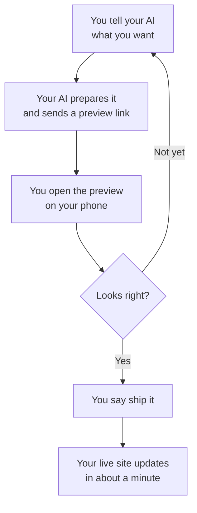

# Your business website

This is **your website**: the files, the words, the photos. It costs about $12 a year (just the domain name) plus the AI plan you already use, and you update it by *talking*: you tell your AI what you want in plain English, it sends you a preview link, you look at it on your phone, and you say "ship it."

No page builders. No monthly website fees. No developer on retainer.

**Not set up yet?** Start with [docs/setup-guide.md](docs/setup-guide.md). You can do it yourself in about an hour, with your AI walking you through every step.

## How updates work: the golden loop

You never edit the live site directly. Every change follows the same loop:

That's the whole system. Nothing goes live until you say "ship it," every change gets its own preview first, and "undo that" takes anything back.

**Watch the whole journey** (36 seconds, no sound needed):

https://github.com/user-attachments/assets/752e5e89-482f-40f9-b1c0-d4fab41c60b9

## What to say to your AI

Tap your **Edit my website** button (or open your AI) and say it the way you'd say it to a person:

- "Change our Saturday hours to 9am to 2pm."
- "Add a banner: we're closed Thanksgiving week, reopening Monday."
- "Add drain cleaning for $129 to the price list."
- "Turn off the testimonials for now."
- "Add a booking button that goes to [your booking link]."
- "What would you change about the homepage?"

You can send a voice note instead of typing. Your AI says back what it heard in one sentence and takes it from there. More examples, slowed down so you can see each step: [docs/examples.md](docs/examples.md).

## Made a mistake? Say "undo that"

Every version of your site is saved, so nothing is ever lost. Say **"undo that"** and your AI prepares the undo as a new preview: you check it and say "ship it." That's all you need to know.

(If your site is ever broken and your AI isn't available, a helper can use the emergency rollback described in `rules/deploy.md`.)

## What good looks like

Your AI should:

- Explain what it's about to do *before* doing it, in one or two plain sentences.
- Never use technical words without explaining them.
- End every change with a preview link you can open on your phone.
- Wait for your "ship it" before anything goes live.
- Ask before anything risky (your domain, your email, deleting things).

If it isn't doing these, say so: "Explain it like I'm new to this" works remarkably well.

## Things worth knowing

- **Small asks work best.** "Change the headline" beats "redesign the site." Big changes still work; they just take a few more preview rounds.
- **Your words win.** If you dictate copy, it goes in exactly as you said it. If your AI rewrites your voice, say "use my words exactly."
- **Photos are your superpower.** Real photos of your real business beat any design tweak. See [docs/gather-your-stuff.md](docs/gather-your-stuff.md).
- **Your files are public, like your website.** Anyone can read them, so only website content goes in. Keys and passwords never do. Phone photos can carry the spot they were taken: turn location off before you upload (see [docs/gather-your-stuff.md](docs/gather-your-stuff.md)), and your AI strips it before anything reaches your live site.
- **You can't run up a bill.** Hosting is free; the domain renews once a year, and that's your choice. No site change can trigger a charge.
- **Every month: the checkup.** Say "run the monthly checkup." Your AI looks for stale hours, old photos, leftover placeholder text, broken links, and changes you never shipped, then proposes fixes. Nothing changes without your yes.
- **Need a logo, a video, or online selling?** Your AI can borrow other apps like Canva, Higgsfield, or Shopify: [docs/connectors.md](docs/connectors.md).
- **No AI handy and just a typo?** [docs/editing-in-browser.md](docs/editing-in-browser.md) shows how to fix it on GitHub.com.

## Your first week

- [ ] Finish setup, if your AI says anything is left (it keeps a checklist in `SETUP.md`).
- [ ] Gather your stuff: photos, your story, your prices ([docs/gather-your-stuff.md](docs/gather-your-stuff.md)). Or ask your AI to interview you.
- [ ] Ship three small changes, so the loop feels normal.
- [ ] When you're ready to launch: connect your own domain ([docs/setup-guide.md](docs/setup-guide.md), "Later: your own domain"). Until then your site works on its free address but is hidden from Google.

Questions: [docs/faq.md](docs/faq.md).

## What's in this folder (the 30-second tour)

- `index.html`: your homepage. The words live here.
- `site.config.json`: your business facts (name, hours, address, phone) and which features are on.
- `public/images/`: the photos on your site. `content/brand/`: your shoebox of photos, logo, and story.
- `docs/`: plain-English guides.
- `AGENTS.md` and `rules/`: the operating manual your AI follows.
- Everything else is machinery your AI handles. You don't need to open it.

## For the technically curious

A static build (Vite, plain HTML/CSS, no framework) served by Cloudflare Workers (static assets, `wrangler.jsonc`). `main` is the live site; every other branch gets its own preview link, and a GitHub ruleset makes sure changes reach `main` only through a pull request. The contact form is a few lines in `src/worker.ts` that email you through Cloudflare Email Routing (no key), and it degrades gracefully until email is set up. `AGENTS.md` + `rules/` are the operating manual for any AI.
