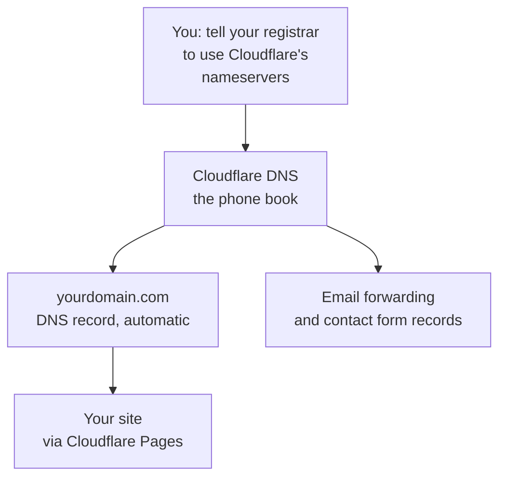

# Domains and DNS: why Cloudflare should hold your DNS

Your domain needs two jobs done: **hosting the site** (Cloudflare Pages) and **DNS** (the phone book that turns `yourdomain.com` into an address). When Cloudflare does both, the good stuff happens automatically:

- The bare domain (`yourdomain.com`, not just `www`) works. Cloudflare can only point a bare domain at your site if it holds the DNS.
- Free email forwarding (`hello@yourdomain.com` to your Gmail) works, because Cloudflare Email Routing needs Cloudflare DNS.
- The contact form can send from your domain, because its verification records live in the same place.
- SSL certificates are automatic.

Until you connect a domain, none of this applies: your site works fine on its free `<project>.pages.dev` address.

## The one move: point your nameservers at Cloudflare

"Moving DNS to Cloudflare" means one change: tell your domain registrar to use Cloudflare's nameservers instead of theirs. Cloudflare is still not your registrar unless you transfer the domain (optional, see below); you're just renting their phone book.

**If you bought the domain from Cloudflare Registrar:** you're done. DNS is already here. Skip to the setup guide.

**If your domain is at GoDaddy, Namecheap, Google Domains, etc.**, do these in order:

1. **Screenshot every DNS record** at your current registrar, before anything changes.
2. **Check for email.** Look for **MX records**. If they exist, your domain receives email (Google Workspace, Microsoft 365, or the registrar's mailboxes) and those records must come across exactly.
3. **Turn off DNSSEC** at the registrar if it's on. Left on, your domain stops working after the move.
4. In Cloudflare: **Add domain** (free plan is fine), enter your domain, continue. **Compare** the records Cloudflare imported against your screenshots, and add anything missing by hand.
5. Cloudflare shows two nameservers, like `ara.ns.cloudflare.com` and `bob.ns.cloudflare.com`. At your registrar, replace the nameservers with those two. If the domain already runs email or a website, do this **outside business hours**; if it doesn't, any time is fine. (Registrars bury it under "DNS", "Nameservers", or "Domain settings"; your AI can walk you through yours.)
6. Back in Cloudflare, click **Check nameservers**. Status flips to **Active** once the change propagates (usually minutes, sometimes a few hours). Don't keep changing things while you wait.
7. **Test email both ways:** send a message to your domain address from another account, and send one from your domain address to another account.

## The email warning (read before switching nameservers)

When you change nameservers, **every DNS record moves to Cloudflare's copy of your zone**. Cloudflare scans and imports common records automatically, but verify these yourself or email breaks:

- **MX records**: where incoming email goes. If mail suddenly stops after the switch, this is why.
- **SPF / DKIM / DMARC** (TXT records): prove your email is legitimate. Needed for the contact form's sending address too.
- Anything unusual: subdomains pointing at other services, verification records.

Your screenshots from step 1 are the safety net: check every record exists in Cloudflare (**DNS** → **Records**), and ask your AI to compare the two lists with you.

**If your domain already has mailboxes** (Google Workspace, Microsoft 365, or your registrar's email), do **not** turn on Cloudflare Email Routing for it. Routing replaces your MX records and would take over your existing mail. Email Routing is only for domains with no email yet.

## Optional: transfer the domain to Cloudflare Registrar

Not required. Transferring moves billing to Cloudflare (wholesale pricing, no markup, often cheaper renewals than GoDaddy/Namecheap) and puts everything in one dashboard. Downsides: some TLDs aren't supported, and there's a 60-day lock after registration/transfer. Do it later if you want; it changes nothing about the site.

## What the setup guide does once your domain is Active

Attach `yourdomain.com` (and `www`) to the Pages project: Cloudflare auto-creates the DNS records (proxied, orange cloud) and provisions SSL. Leave them proxied. Then tell your AI "my domain is connected" so it updates your site for Google.
