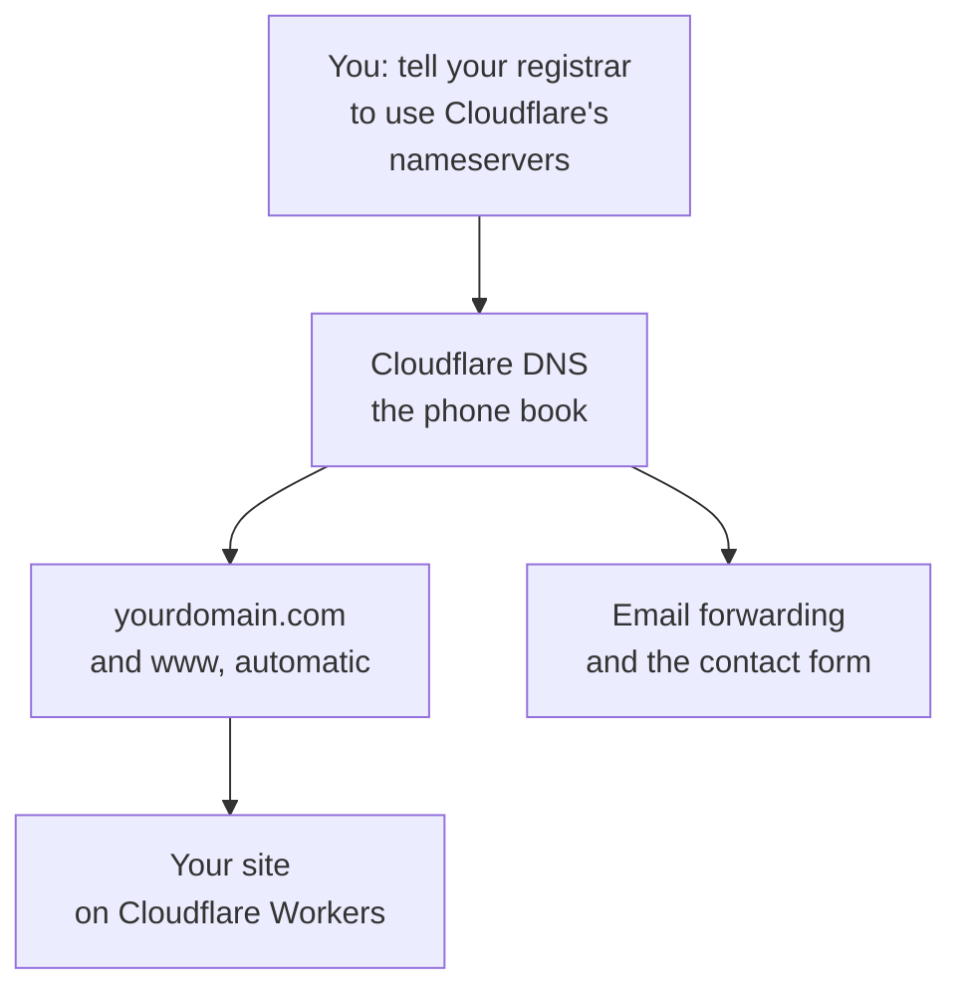

# Domains and DNS: why Cloudflare should hold your DNS

Your domain needs two jobs done: **hosting the site** (Cloudflare) and **DNS** (the phone book that turns `yourdomain.com` into an address). Your site runs on Cloudflare Workers, and Workers can only attach a domain whose DNS Cloudflare runs. So for this site, moving DNS to Cloudflare isn't just nice, it's how your domain gets connected. In return, the good stuff happens automatically:

- Both `yourdomain.com` and `www.yourdomain.com` work, with SSL certificates made for you.
- Free email forwarding (`hello@yourdomain.com` to your Gmail) works, because Cloudflare Email Routing needs Cloudflare DNS.
- The contact form can email you, because it sends through that same Email Routing.

Until you connect a domain, none of this applies: your site works fine on its free `<name>.<account>.workers.dev` address.

## The one move: point your nameservers at Cloudflare

"Moving DNS to Cloudflare" means one change: tell your domain registrar to use Cloudflare's nameservers instead of theirs. Cloudflare is still not your registrar unless you transfer the domain (optional, see below); you're just using their phone book.

**If you bought the domain from Cloudflare Registrar:** you're done. DNS is already here. Skip to the setup guide.

**If your domain is at GoDaddy, Namecheap, Squarespace, etc.**, do these in order:

1. **Screenshot every DNS record** at your current registrar, before anything changes.
2. **Check for email.** Look for **MX records**. If they exist, your domain receives email (Google Workspace, Microsoft 365, or the registrar's mailboxes) and those records must come across exactly.
3. **Turn off DNSSEC** at the registrar if it's on. Left on, your domain stops working after the move.
4. In Cloudflare: **Add domain** (free plan is fine), enter your domain, continue. **Compare** the records Cloudflare imported against your screenshots, and add anything missing by hand.
5. Cloudflare shows two nameservers, like `ara.ns.cloudflare.com` and `bob.ns.cloudflare.com`. At your registrar, replace the nameservers with those two. Do this **outside business hours**. (Registrars bury it under "DNS", "Nameservers", or "Domain settings"; your AI can walk you through yours.)
6. Back in Cloudflare, click **Check nameservers**. Status flips to **Active** once the change propagates (usually minutes, sometimes a few hours). Don't keep changing things while you wait.
7. **Test email both ways:** send a message to your domain address from another account, and send one from your domain address to another account.

## The email warning (read before switching nameservers)

When you change nameservers, **every DNS record moves to Cloudflare's copy of your zone**. Cloudflare scans and imports common records automatically, but verify these yourself or email breaks:

- **MX records**: where incoming email goes. If mail suddenly stops after the switch, this is why.
- **SPF / DKIM / DMARC** (TXT records): prove your email is legitimate.
- Anything unusual: subdomains pointing at other services, verification records.

Your screenshots from step 1 are the safety net: check every record exists in Cloudflare (**DNS** → **Records**), and ask your AI to compare the two lists with you.

**If your domain already has mailboxes** (Google Workspace, Microsoft 365, or your registrar's email), do **not** turn on Cloudflare Email Routing for the domain itself. Routing replaces your MX records and would take over your existing mail. Your contact form can still work: your AI turns Email Routing on for a subdomain only (like `mail.yourdomain.com`), which leaves your mailboxes alone ([api-keys.md](api-keys.md)).

## Attaching the domain to your site

Once your domain shows **Active** in Cloudflare: **Workers & Pages** → your site → **Settings** → **Domains & Routes** → **Add** → **Custom domain** → `yourdomain.com`, then again for `www.yourdomain.com`. Cloudflare creates the DNS records and certificates itself. If it complains that a record already exists for that name (often an old `www` record pointing at your previous website), delete that one record in **DNS** → **Records** first; your AI will check it with you.

Then your domain → **SSL/TLS** → **Edge Certificates** → **Always Use HTTPS** on, so nobody lands on an unsecured page.

Tell your AI "my domain is connected" so it updates your site for Google.

## Keeping your DNS where it is (the fallback)

Some owners can't or won't move nameservers: an IT company controls the domain, the registrar is a website builder that makes it hard, or the email setup is too precious to touch. That's a fair call, and there's a fallback. Know what it costs first:

| | DNS on Cloudflare (recommended) | DNS stays where it is |
|---|---|---|
| Your site runs on | Cloudflare Workers | Cloudflare **Pages** (same files, same repository) |
| Your address | `yourdomain.com` and `www` | `www.yourdomain.com`; the bare domain forwards to it with your registrar's "domain forwarding" |
| Contact form email | Yes (Email Routing) | **No.** The form section shows your phone and email instead (it's turned off) |
| `hello@` forwarding | Yes, free | Whatever your registrar offers |
| Preview links, "ship it", "undo that" | Yes | Yes |
| Visitor stats | Yes | Yes |

How your AI sets it up (one time, about 20 minutes):

1. Cloudflare → **Workers & Pages** → **Create** → **Pages** → **Import an existing Git repository** → your site's repository. Production branch `main`, framework preset **None**, build command `npm run build`, output directory `dist`. **Save and Deploy.** (Pages ignores `wrangler.jsonc`; the site is just files there.)
2. Turn off the Workers copy so two copies don't build every change: your Workers site → **Settings** → **Builds** → **Disconnect**.
3. Your AI turns the contact form off (`contactForm: false` in `site.config.json`) as a normal change.
4. Pages project → **Custom domains** → **Set up a custom domain** → `www.yourdomain.com`. Cloudflare tells you one **CNAME** record to add at your current DNS provider (`www` pointing at `<project>.pages.dev`). Add exactly that, nothing else.
5. At your registrar, forward `yourdomain.com` to `https://www.yourdomain.com` (most call it "domain forwarding" or "redirect").

Preview links then look like `https://<branch>.<project>.pages.dev` and are hidden from Google by the same `public/_headers`. You can switch to the recommended setup later by moving your nameservers; nothing about the site has to change.

## Optional: transfer the domain to Cloudflare Registrar

Not required. Transferring moves billing to Cloudflare (wholesale pricing, no markup, often cheaper renewals than GoDaddy/Namecheap) and puts everything in one dashboard. Downsides: some TLDs aren't supported, and there's a 60-day lock after registration/transfer. Do it later if you want; it changes nothing about the site.
